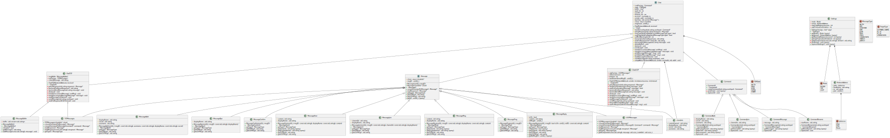
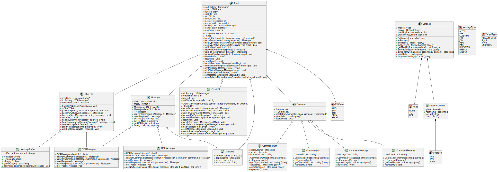
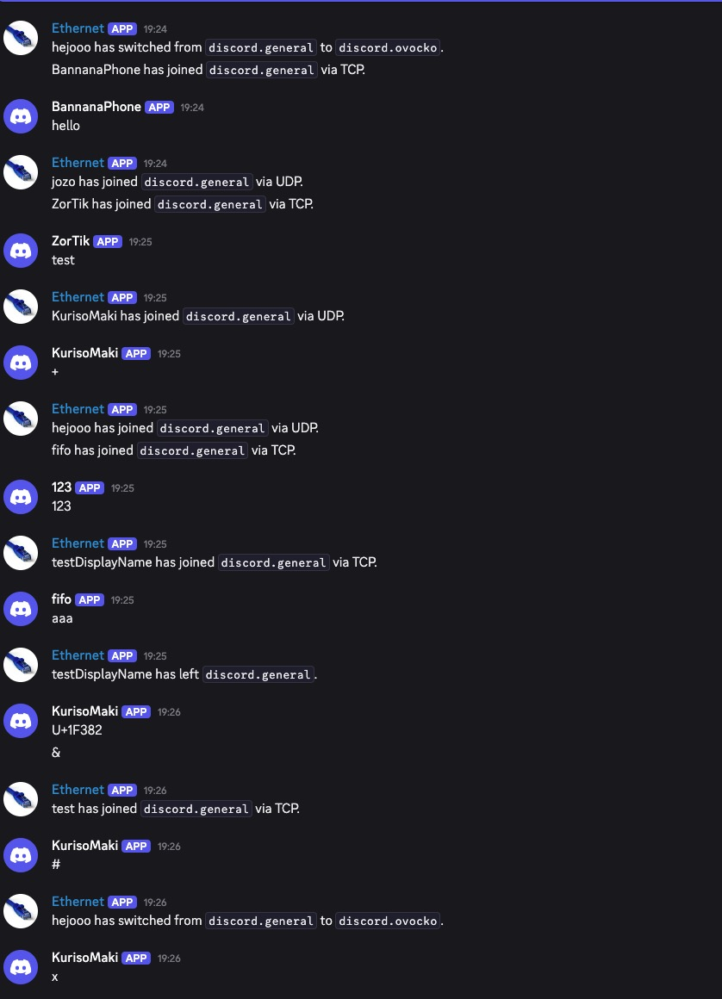

# IPKproj2

## Table of Contents
- [Executive Summary](#executive-summary)
    - [Understanding TCP and UDP Protocols](#understanding-tcp-and-udp-protocols)
        - [TCP (Transmission Control Protocol)](#tcp-transmission-control-protocol)
        - [UDP (User Datagram Protocol)](#udp-user-datagram-protocol)
    - [Object-Oriented Programming (OOP) in the Project](#object-oriented-programming-oop-in-the-project)
- [Application Overview](#application-overview)
    - [Overview](#overview)
    - [Running the Chat Client](#running-the-chat-client)
- [UML Diagrams or Code Narratives](#uml-diagrams-or-code-narratives)
    - [UML Diagram](#uml-diagram)
    - [Design Philosophy](#design-philosophy)
    - [Directory Tree](#directory-tree)
- [Features](#features)
- [Testing](#testing)
    - [Arguments Testing](#arguments-testing)
    - [TCP Testing](#tcp-testing)
        - [Localhost Testing](#localhost-testing)
        - [Test Case 1: Help Command](#test-case-1-help-command)
        - [Test Case 2: Login Command](#test-case-2-login-command)
        - [Test Case 3: Sending Messages](#test-case-3-sending-messages)
        - [Test Case 4: Rename Command](#test-case-4-rename-command)
        - [Test Case 5: Sending Messages After Rename](#test-case-5-sending-messages-after-rename)
        - [Test Case 6: Joining a New Channel](#test-case-6-joining-a-new-channel)
        - [Test Case 7: Bad Reply for Authentication](#test-case-7-bad-reply-for-authentication)
        - [Test Case 8: Sending Messages Without Authentication](#test-case-8-sending-messages-without-authentication)
        - [Test Case 9: Timeout on Authentication Request](#test-case-9-timeout-on-authentication-request)
        - [Test Case 10: Running Client with an Invalid Server](#test-case-10-running-client-with-an-invalid-server)
        - [Test Case 11: Termination via Ctrl+C/Ctrl+D](#test-case-11-termination-via-ctrlcctrld)
        - [Discord Server Testing TCP](#discord-server-testing-tcp)
    - [UDP Testing](#udp-testing)
        - [UDP Testing v1: Basic Implementation with Python Server](#udp-testing-v1-basic-implementation-with-python-server)
        - [Test Case 1: Displaying Help](#test-case-1-displaying-help)
        - [Test Case 2: Authentication](#test-case-2-authentication)
        - [Test Case 3: Sending a Message](#test-case-3-sending-a-message)
        - [Test Case 4: Receiving a Message from the Server](#test-case-4-receiving-a-message-from-the-server)
        - [Test Case 5: Joining a New Channel](#test-case-5-joining-a-new-channel)
        - [Test Case 6: Sending a Message After Joining a New Channel](#test-case-6-sending-a-message-after-joining-a-new-channel)
        - [Test Case 7: Renaming the Client](#test-case-7-renaming-the-client)
        - [Test Case 8: Sending a Message After Renaming](#test-case-8-sending-a-message-after-renaming)
        - [Test Case 9: Graceful Termination (Ctrl+C / Ctrl+D)](#test-case-9-graceful-termination-ctrlc--ctrld)
        - [Test Case 10: Server Ping Message](#test-case-10-server-ping-message)
        - [Test Case 13: Packet Loss Simulation](#test-case-13-packet-loss-simulation)
        - [Test Case 15: Maximum Retransmission Testing](#test-case-15-maximum-retransmission-testing)
        - [Discord Server Testing UDP](#discord-server-testing-udp)
    - [Testing Environment](#testing-environment)
- [Bibliography](#bibliography)


---

## Application Overview

### Overview
This project is a command-line-based chat client that implements the IPK25-chat protocol. For detailed specifications, refer to the official documentation [2].
The resulting application enables seamless communication between users via a remote server, supporting both TCP and UDP protocols. With a focus on usability and functionality, the client allows users to perform the following actions:
- Authenticate with the server.
- Send and receive messages in real-time.
- Join and participate in different chat channels.
- Change their display name dynamically.
- Gracefully exit the application, notifying the server of the disconnection (via Ctrl+C or Ctrl+D).

This tool is designed to provide a reliable and straightforward messaging experience, leveraging robust protocol support and intuitive command-line interactions.

### Running the Chat Client

Before running the application, ensure you are using linux/macOS and that the project is built using the `make` command. Once built, execute the program using `./ipk25-chat` followed by the appropriate command line arguments. Below is a summary of the supported arguments:

- `-t <tcp|udp>`: Specifies the transport protocol to be used for the connection. Acceptable values are `tcp` or `udp`.
- `-s <IP address|hostname>`: Defines the server's IP address or hostname to connect to.
- `-p <port>`: Sets the server port number. Default is `4567`.
- `-d <timeout>`: Specifies the UDP confirmation timeout in milliseconds. Default is `250`.
- `-r <retries>`: Indicates the maximum number of UDP retransmissions. Default is `3`.
- `-h`: Displays the program's help information and exits.

---
## Executive Summary
### Understanding TCP and UDP Protocols

To fully grasp the functionality of the chat client, it is essential to understand the differences between the TCP and UDP protocols. Both protocols are built on top of the Internet Protocol (IP) and are often referred to as TCP/IP or UDP/IP. These protocols are designed to serve a single purpose: transmitting information over a network from one computer to another. This communication is achieved by sending packets (small units of data) between devices. However, the way these packets are transmitted differs significantly between TCP and UDP.

#### TCP (Transmission Control Protocol)
TCP is a connection-oriented protocol that ensures reliable communication between devices. It provides several features that make it robust:
- **Reliability**: TCP guarantees that all packets are delivered, and they arrive in the correct order. If a packet is lost during transmission, TCP automatically retransmits it.
- **Error Checking**: TCP includes mechanisms to detect and correct errors in transmitted data.
- **Stream-Based Communication**: TCP treats communication as a continuous stream of data. However, this introduces a minor inconvenience during implementation. For example, when receiving data, you may only receive a portion of a complete message. To handle this, a buffer is required on the client side to assemble the full message. Similarly, when sending data, you must repeatedly call the `send()` function until the entire message is transmitted.

While TCP is highly reliable, its robustness comes at the cost of increased overhead, making it slower compared to UDP. This overhead includes connection establishment (via a three-way handshake) and additional metadata in each packet.

#### UDP (User Datagram Protocol)
UDP, on the other hand, is a connectionless protocol that prioritizes speed and efficiency over reliability. Key characteristics of UDP include:
- **No Guaranteed Delivery**: Packets sent via UDP may be lost during transmission, and there is no built-in mechanism to retransmit lost packets.
- **Out-of-Order Delivery**: Packets may arrive out of order, as UDP does not enforce sequencing.
- **Lightweight**: UDP has minimal overhead, making it faster than TCP for scenarios where speed is critical.

To address the lack of reliability in UDP, the IPK25-chat protocol implements additional mechanisms:
- **Acknowledgment Messages**: When a packet is received, the recipient sends a confirmation (CONFIRM) message back to the sender. If the sender does not receive this confirmation, it retransmits the packet. This process is repeated up to a predefined number of retries (N). If no confirmation is received after N attempts, the connection is considered dropped.
- **Ping Messages**: The server periodically sends ping messages to the client to verify that the connection is still active.

These enhancements ensure that the IPK25-chat protocol provides a reliable communication experience, even when using UDP. For a detailed explanation of the protocol, refer to the [official specification](https://git.fit.vutbr.cz/NESFIT/IPK-Projects/src/branch/master/Project_2#specification).

---

### Object-Oriented Programming (OOP) in the Project

The project is implemented in C++ and leverages Object-Oriented Programming (OOP) principles. OOP is a programming paradigm that organizes code into objects, which encapsulate both data (state) and behavior (methods). This approach offers several advantages:
- **Encapsulation**: Objects hide their internal state and expose functionality through well-defined interfaces. This ensures that the internal workings of an object are not directly accessible, promoting data integrity and security.
- **Modularity**: By breaking the application into smaller, self-contained objects, the code becomes easier to manage, test, and maintain.
- **Reusability**: Objects and classes can be reused across different parts of the application or even in other projects, reducing redundancy.
- **Scalability**: OOP makes it easier to extend the application by adding new features or modifying existing ones without affecting unrelated components.


---
## UML Diagrams or Code Narratives
 
### UML Diagram

The diagram above was generated directly from the project's header files [1].

As shown, the project contains a significant number of classes. However, many of these are derived from the `Message` class hierarchy. These `Message` classes share a common purpose: they encapsulate data that can be serialized and sent to the server. For instance, `MessageAuth` and `MessageReply` differ primarily in how they construct the message (datagram) to be transmitted.

To simplify the visualization, the second diagram omits most of the `Message` classes, focusing instead on the broader structure of the application. This streamlined view highlights the core components while avoiding redundancy in the representation of similar classes.



### Design Philosophy

For this project, I adopted a bottom-up development approach. I began by addressing the smallest, most fundamental issues and incrementally built upon them to solve larger problems. This method allowed me to create a collection of small, modular components that were later combined to address more complex challenges.

#### Argument Handling
The first step was to handle command-line arguments. To achieve this, I developed a `Settings` class, which encapsulates the logic for parsing and managing arguments. After thoroughly testing this class, I moved on to the next problem.

#### Command Interface
Next, I focused on designing an interface for interpreting user input and translating it into actionable commands. This led to the creation of a `Command` concept. User input, a key aspect of the application, is processed into `Command` objects. These objects have various specialized subclasses, such as `CommandAuth` and `CommandMSG`, each representing a specific type of command and encapsulating the necessary data for further processing. To streamline the creation of these commands, I implemented a factory method, `createCommand`, which converts user input into the appropriate `Command` subclass.

#### Message Handling
For message handling, I followed a similar approach. I designed an abstract `Message` class that defines a common interface and includes shared functionality. From this base class, I derived two specialized classes: `UDPMessage` and `TCPMessage`. These classes provide methods like `readResponse`, which takes a datagram and converts it into a corresponding `Message` object. 

The resulting `Message` objects, such as `MessageAuth` and `MessageError`, are further specialized subclasses. Each of these classes implements two key virtual methods: `getTCPMsg` and `getUDPMsg`, which convert the message into a datagram suitable for transmission. Additionally, these classes include specific getter methods, such as `getDisplayName` and `getSecret` for `MessageAuth`, enabling easy access to their contents.

This design ensures a robust and flexible way to handle messages, allowing for seamless serialization, deserialization, and interaction with their contents.

#### Main Logic and Finite State Machine (FSM)
With the foundational components in place, I turned my attention to the main application logic. I designed an abstract `Chat` class to serve as the core of the client. This class implements a finite state machine (FSM) to manage the client's states and provides essential methods, such as `waitForResponse` (with a configurable timeout) and `eventLoop`, which drives the client's functionality.

From the `Chat` class, I derived two specialized subclasses: `ChatTCP` and `ChatUDP`. These subclasses implement protocol-specific logic by overriding the virtual methods in the base class and introducing additional helper methods to handle the unique requirements of TCP and UDP communication.

#### Main Function
In the `main` function, the program begins by parsing command-line arguments. Based on the selected mode (TCP or UDP), the appropriate chat class (`ChatTCP` or `ChatUDP`) is instantiated. Finally, the program invokes the `eventLoop` method of the instantiated class, initiating the client's functionality.

This structured, modular approach ensures that the application is both maintainable and extensible, with clear separation of concerns between components.

### Directory Tree
The following directory tree outlines the structure of the repository, showing where key files and modules are located:

```
IPKproj2/
├── include/
│   ├── chat.hpp          
│   ├── command.hpp       
│   ├── message.hpp       
│   ├── messageBuffer.hpp 
│   ├── settings.hpp      
│   ├── utils.hpp         
│   └── other_headers.hpp 
├── src/
│   ├── chat.cpp          
│   ├── chatTCP.cpp          
│   ├── chatUDP.cpp          
│   ├── command.cpp          
│   ├── main.cpp          
│   ├── message.cpp          
│   ├── messageBuffer.cpp          
│   └── settings.cpp  
├── docs/
│   ├── umlBig.svg        
│   └── umlSmall.svg      
├── README.md             
├── LICENSE               
├── udpServer.py          
├── Makefile              
└── .gitignore            
```

The separation of `.cpp` and `.hpp` files serves a practical purpose: it simplifies navigation and organization within the project. By keeping implementation details in `.cpp` files and declarations in `.hpp` files, it becomes easier to locate specific components.

---

## Testing

### Arguments testing

Initially, I tested the argument parsing functionality, as it is not the primary focus of this project. During the early stages of development, I conducted basic tests by running the program with various combinations of arguments and comparing the results. To facilitate this process, I implemented a method in the `Settings` class that displays the saved arguments. This method provided a clear representation of the parsed arguments, ensuring their correctness. Below is an example of its output:

### TCP Testing

#### Localhost Testing

For TCP testing, I utilized `nc` (netcat), a utility built into Unix systems. I created a macro in my `Makefile` to launch it conveniently. Using `nc`, I simulated the server by manually typing responses to the client's messages. Below, you will find detailed descriptions of each test case, including screenshots of the client, server, and Wireshark captures. Note that all tests were conducted sequentially to validate the correctness of the client's finite state machine (FSM). As a result, you may observe old messages appearing in subsequent tests.

---

#### Test Case 1: Help Command

**Description:**  
This test verifies that the client correctly displays the help information without sending any messages to the server.

**Client Screenshot:**  


**Server Screenshot:**  


**Wireshark Screenshot:**  


**Outcome:**  
The program behaved as expected. The help information was displayed to the user, and no messages were sent from the client to the server.

---

#### Test Case 2: Login Command

**Description:**  
This test simulates a login attempt by the client and verifies the correct exchange of messages between the client and server.

**Steps:**
1. On the client, I entered the command `/auth asdf asdf asdf` to simulate a login attempt.
2. On the server (using `nc`), I received the message in the correct format.
3. I responded with `REPLY OK IS asdf` to indicate a successful login.

**Client Screenshot:**  


**Server Screenshot:**  


**Wireshark Screenshot:**  


**Outcome:**  
The client successfully displayed the message "Action successful" upon receiving the server's response. The test was completed successfully.

---
#### Test Case 3: Sending Messages

**Description:**  
This test simulates sending messages from the client to the server, as well as the server receiving a message from another client and forwarding it back to the original client.

**Steps:**  
1. On the client, enter the message `hello` and press Enter.  
2. On the server, simulate receiving a message from another client by entering `MSG FROM honza IS ahoj`.

**Client Screenshot:**  


**Server Screenshot:**  


**Wireshark Screenshot:**  


**Outcome:**  
As shown in the screenshots, the messages were correctly formatted and appeared on the server. The client displayed the messages accurately, confirming the test was successful.

---

#### Test Case 4: Rename Command

**Description:**  
This test simulates the client executing the `/rename` command to change its username. Subsequent messages should reflect the updated username.

**Steps:**  
1. Run the `/rename` command on the client with the new username: `client`.

**Client Screenshot:**  


**Server Screenshot:**  


**Wireshark Screenshot:**  


**Outcome:**  
After executing the `/rename` command, the client displayed a success message indicating the username change. No messages were sent to the server, as the change is local to the client. This behavior is correct and expected.

---

#### Test Case 5: Sending Messages After Rename

**Description:**  
This test verifies that the client uses the updated username when sending messages after executing the `/rename` command.

**Steps:**  
1. Send a message to the server after renaming the client.

**Client Screenshot:**  


**Server Screenshot:**  


**Wireshark Screenshot:**  


**Outcome:**  
The screenshots confirm that the client used the new username when sending messages, validating the test's success.

---

#### Test Case 6: Joining a New Channel

**Description:**  
This test simulates the client joining a new channel using the `/join` command.

**Steps:**  
1. Send the `/join` command from the client.  
2. On the server, simulate a positive reply by typing: `REPLY OK IS asdfasdf`.  
3. Observe the client's response.

**Client Screenshot:**  


**Server Screenshot:**  


**Wireshark Screenshot:**  


**Outcome:**  
The client correctly sent the join message and displayed the server's reply accurately. This test was successful.

---

#### Test Case 7: Bad Reply for Authentication

**Description:**  
This test evaluates the client's behavior when the authentication process fails due to a negative server response.

**Steps:**  
1. Send an `/auth` message from the client.  
2. Simulate a negative reply from the server.  
3. Observe the client's response.

**Client Screenshot:**  


**Server Screenshot:**  


**Wireshark Screenshot:**  


**Outcome:**  
The client correctly identified the negative reply and displayed an appropriate error message, confirming the test's success.

---

#### Test Case 8: Sending Messages Without Authentication

**Description:**  
This test simulates the client attempting to send a message without being authenticated.

**Steps:**  
1. Attempt to send a message to the server without establishing authentication.

**Client Screenshot:**  


**Server Screenshot:**  


**Wireshark Screenshot:**  


**Outcome:**  
The client behaved as expected by preventing the user from sending a message without authentication. No messages were sent to the server, and an error message was displayed to the user.

---

#### Test Case 9: Timeout on Authentication Request

**Description:**  
This test simulates the server taking too long to respond to an authentication request, triggering a timeout.

**Steps:**  
1. Send an `/auth` request from the client.  
2. Wait for the 5-second timeout to elapse without receiving a response.

**Client Screenshot:**  


**Server Screenshot:**  


**Wireshark Screenshot:**  


**Outcome:**  
The client sent an error message to the server indicating the timeout and terminated the connection, as expected. This behavior aligns with the protocol's requirements.

---

#### Test Case 10: Running Client with an Invalid Server

**Description:**  
This test evaluates the client's behavior when attempting to connect to an invalid or non-existent server.

**Client Screenshot:**  


**Outcome:**  
The client displayed an appropriate error message and terminated itself, as expected.

---

#### Test Case 11: Termination via Ctrl+C/Ctrl+D

**Description:**  
This test verifies the client's behavior when terminated using Ctrl+C or Ctrl+D after logging in.

**Steps:**  
1. Send an `/auth` request from the client.  
2. Simulate a successful login by replying on the server.  
3. Terminate the client using Ctrl+C or Ctrl+D.

**Client Screenshot:**  


**Server Screenshot:**  


**Wireshark Screenshot:**  


**Outcome:**  
The client gracefully terminated the connection by sending a `BYE` message to the server. The same behavior was observed when using Ctrl+D.

---

#### Discord Server Testing TCP

The project was tested on a Discord-integrated server provided by the assignment. Below are examples demonstrating the client's interaction with the Discord server.

#### Test Case 12: Joining a Discord Channel

**Client Screenshot:**  


**Server Screenshot:**  


#### Test Case 13: Switching Discord Channels

**Client Screenshot:**  


**Server Screenshot:**  


#### Test Case 14: Sending Messages After Channel Switch

**Client Screenshot:**  


**Server Screenshot:**  


#### Test Case 15: Exiting Discord Channel

**Client Screenshot:**  


**Server Screenshot:**  


---

#### Conclusion

Extensive testing was conducted, including interactions with the Discord server. The client performed reliably, with no unexpected errors observed. However, one edge case—handling multiple messages in a single packet or partial messages—was not fully tested due to time constraints. This limitation arose from delays in completing the UDP implementation. Overall, the client demonstrated robust functionality and adherence to the protocol.

---

### UDP Testing

When testing UDP, I could not rely on `nc` as I did for TCP testing. This limitation arose because the protocol requires messages to include null bytes (`\0`), which are challenging to input manually. Additionally, the protocol mandates sending a confirmation message for each message received from the server. Managing this process manually with a keyboard would be impractical for a single person.

To address this, I developed a Python-based server with the assistance of ChatGPT. This server emulates the behavior of `nc` while providing additional functionality, such as automatically sending confirmation messages. This approach streamlined the testing process and ensured compliance with the protocol's requirements.

---

### UDP Testing v1: Basic Implementation with Python Server

To validate the client's functionality, I initially configured the server to ensure no packet loss. This allowed me to verify the core functionality before testing edge cases, such as packet loss scenarios.

---

### Test Case 1: Displaying Help

**Description:**  
This test verifies whether the client correctly displays the help message. No traffic should be sent to the server.

**Steps:**  
1. Use the `/help` command on the client and observe the output.

**Client Screenshot:**  


**Server Screenshot:**  


**Wireshark Screenshot:**  


**Outcome:**  
The client displayed the help message as expected, and no traffic was sent to the server. The test was successful.

---

### Test Case 2: Authentication

**Description:**  
This test verifies the client's ability to authenticate with the server. The server is configured to automatically confirm the message and send a positive response. The authentication attempt is expected to succeed.

**Steps:**  
1. Send the `/auth` command to the server.
2. Observe the client, server, and Wireshark logs.

**Client Screenshot:**  


**Server Screenshot:**  


**Wireshark Screenshot:**  


**Outcome:**  
The server received the authentication message, sent a confirmation, and initiated a session on a dynamic port (61700). The client responded with a confirmation message. All interactions were correctly logged in Wireshark, marking the test as successful.

---

### Test Case 3: Sending a Message

**Description:**  
This test verifies the client's ability to send a message to the server.

**Steps:**  
1. Send a message through the client.

**Client Screenshot:**  


**Server Screenshot:**  


**Wireshark Screenshot:**  


**Outcome:**  
The client sent the message, and the server received it in the correct format. The server then sent a confirmation back to the client. The test was successful.

---

### Test Case 4: Receiving a Message from the Server

**Description:**  
This test simulates the server sending a message to the client.

**Steps:**  
1. Use the `/msg <username> <message>` command on the server to send a message to the client.

**Client Screenshot:**  


**Server Screenshot:**  


**Wireshark Screenshot:**  


**Outcome:**  
The client received the message, displayed it on the terminal, and sent a confirmation back to the server. The test was successful.

---

### Test Case 5: Joining a New Channel

**Description:**  
This test verifies the client's ability to join a new channel on the server.

**Steps:**  
1. Send the `/join channel1` command through the client.

**Client Screenshot:**  


**Server Screenshot:**  


**Wireshark Screenshot:**  


**Outcome:**  
The client correctly formatted the join message, which was confirmed by the server. The server then sent a reply, and the client responded with a confirmation. The test was successful.

---

### Test Case 6: Sending a Message After Joining a New Channel

**Description:**  
This test verifies the client's ability to send a message after joining a new channel.

**Steps:**  
1. Send a message after joining a new channel.
2. Send a message form the server using the `/msg` command

**Client Screenshot:**  


**Server Screenshot:**  


**Wireshark Screenshot:**  


**Outcome:**  
The client correctly formatted and sent the message to the server. The server received it and sent a confirmation back. The test was successful.

---

### Test Case 7: Renaming the Client

**Description:**  
This test verifies the client's ability to execute the `/rename` command and change its display name.

**Steps:**  
1. Execute the `/rename worker1` command on the client.

**Client Screenshot:**  


**Server Screenshot:**  


**Wireshark Screenshot:**  


**Outcome:**  
The client executed the rename command successfully. No additional traffic was detected on the server or Wireshark, marking the test as successful.

---

### Test Case 8: Sending a Message After Renaming

**Description:**  
This test verifies that the client uses the updated display name when sending messages after executing the `/rename` command.

**Steps:**  
1. Send a message after renaming the client.

**Client Screenshot:**  


**Server Screenshot:**  


**Wireshark Screenshot:**  


**Outcome:**  
The client sent the message with the updated display name, as expected. The test was successful.

---

### Test Case 9: Graceful Termination (Ctrl+C / Ctrl+D)

**Description:**  
This test verifies the client's behavior when terminated gracefully using Ctrl+C or Ctrl+D (EOF on STDIN). The client is expected to send a `BYE` message to the server, and the server should respond with a confirmation.

**Steps:**  
1. Press Ctrl+C or Ctrl+D on the client.

**Client Screenshot:**  


**Server Screenshot:**  


**Wireshark Screenshot:**  


**Outcome:**  
Upon pressing Ctrl+C, the client sent a `BYE` message to the server. The server responded with a confirmation, and the client terminated as expected. The test was successful.

---
### Test Case 10: Server Ping Message

**Description:**  
Due to the nature of the UDP protocol, the server can periodically send a ping message to the client. The client is expected to respond with a confirmation message.

**Steps:**
1. Authenticate with the server using the client's `/auth` command.
2. Send a ping message from the server.

**Client Screenshot:**  


**Server Screenshot:**  


**Wireshark Screenshot:**  


**Outcome:**  
The client successfully received the ping message and correctly sent a confirmation message back to the server.

---

### Test Case 13: Packet Loss Simulation

**Description:**  
For this test, I modified the server to introduce a random delay of 0.2 to 0.3 seconds before sending confirmation messages. Since the default retransmission timeout is set at 0.25s, there's a high probability that some confirmations will arrive after the timeout, causing the client to retransmit packets.


**Steps:**
1. Authenticate with the server
2. Send messages to observe client retransmission behavior

**Client Screenshot:**  


**Server Screenshot:**  


**Wireshark Screenshot:**  


**Outcome:**  
As observed in the Wireshark capture, the message "helloooo" was transmitted twice before the server's confirmation arrived. The client correctly implemented the retransmission protocol while ignoring duplicate confirmations, demonstrating proper handling of delayed packets.

---

### Test Case 15: Maximum Retransmission Testing

**Description:**  
In this test, I disabled the server's ability to send confirmation messages back to the client. The expected behavior is for the client to attempt sending the message three times (the default retransmission limit), waiting 0.25s between each attempt. If no confirmation is received after the third attempt, the client should determine the connection is lost and exit.


**Steps:**
1. Authenticate with the server (the code modification takes effect after authentication)
2. Attempt to send a message to the server

**Client Screenshot:**  


**Server Screenshot:**  


**Wireshark Screenshot:**  


**Outcome:**  
The client successfully connected to the server and authenticated. When sending a message, it correctly attempted retransmission three times as specified in the protocol. After the third failed attempt, the client determined the connection was lost and exited cleanly. While I considered adding a final error message indicating the connection was dropped, such a message would be meaningless if the connection truly failed. The test confirms proper implementation of the retransmission limit and connection failure handling.

---
#### Discord Server Testing UDP

Similar to the TCP implementation, the Discord server also supports a UDP variant. Below are logs demonstrating the functionality of the client when interacting with the Discord server over UDP.

#### Test Case 16: Testing on Discord

**Client Screenshot:**  


**Server Screenshot 1:**  


**Server Screenshot 2:**  


**Conclusion:**  
The client successfully handled all incoming messages and was able to join a different channel without any issues. This demonstrates the robustness of the client's UDP implementation when interacting with the Discord server.

---

### Testing Environment

The application was tested on multiple platforms to ensure compatibility and reliability:
- A MacBook.
- The virtual machine provided as part of the assignment.
- A Fedora workstation.

This diverse testing environment helped validate the application's functionality across different systems.

---

## Bibliography

### Use of AI
For this project, I leveraged AI tools like GitHub Copilot to streamline code autocompletion and improve development efficiency. A single segment of code was generated using AI, and it has been clearly marked with a comment for full transparency. Additionally, I used ChatGPT to refine and enhance the structure of my documentation. As someone with dyslexia, I occasionally face challenges with spotting minor grammatical errors, organizing word order, and ensuring overall clarity in my writing. These tools have been instrumental in helping me create documentation that is polished, professional, and easier to understand. They also assisted in summarizing complex topics, deepening my comprehension of those subjects.

### Bibliography
[1] Scribles.net. (2024). *Generating UML Class Diagram from C++ Header File using PlantUML*. Available from: [https://scribles.net/generating-uml-class-diagram-from-c-header-file-using-plantuml/](https://scribles.net/generating-uml-class-diagram-from-c-header-file-using-plantuml/) [Accesed 20 April 2025]

[2] NESFIT/IPK-Projects Available from: [https://git.fit.vutbr.cz/NESFIT/IPK-Projects/src/branch/master/Project_2/README.md](https://git.fit.vutbr.cz/NESFIT/IPK-Projects/src/branch/master/Project_2/README.md)  [Accesed 20 April 2025]

- Postel, J. (1981). *Transmission Control Protocol*. RFC 793. DOI: [10.17487/RFC793](https://doi.org/10.17487/RFC793). Available at: [https://datatracker.ietf.org/doc/html/rfc793](https://datatracker.ietf.org/doc/html/rfc793) [Accesed 20 April 2025]

- Eggert, L., Fairhurst, G., & Shepherd, G. (2017). *UDP Usage Guidelines*. Updated by: 8899. Errata Exist. Internet Engineering Task Force (IETF). RFC 8085. DOI: [10.17487/RFC8085](https://doi.org/10.17487/RFC8085). Available at: [https://www.rfc-editor.org/rfc/rfc8085.html](https://www.rfc-editor.org/rfc/rfc8085.html). [Accesed 20 April 2025]
